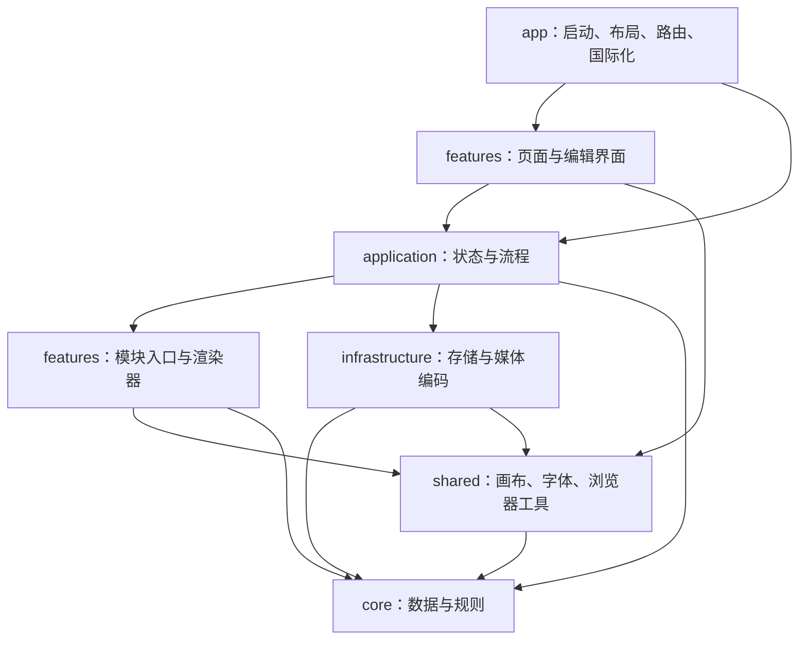

# 架构与扩展

## 依赖边界

`core` 是纯 TypeScript 模型，不依赖 Vue、DOM、存储或具体页面。`shared` 提供通用能力，`infrastructure` 对接浏览器 API，`application` 负责组合，`features` 保存具体功能，`app` 组装应用。

页面调用应用流程。应用通过 `application/catalog.ts` 引用功能注册入口，不直接引用具体编辑器或渲染器。编辑器通过动态导入加载。不同功能不能引用彼此的内部文件；它们共用 `features/types.ts` 的模块契约。

`tests/architecture/boundaries.test.ts` 检查静态和动态导入的目标、上述边界以及即时导入的循环依赖。违反边界会使 `pnpm test` 失败。

## 各部分的归属

| 部分                 | 归属与约定                                                                                                                  |
| -------------------- | --------------------------------------------------------------------------------------------------------------------------- |
| 启动与路由           | `app/main.ts` 和 `app/router.ts`。入口安装 Pinia、路由、国际化和样式。                                                      |
| 布局与导航           | `app/App.vue`、`app/components/AppHeader.vue`。项目列表属于 `features/projects`，首页不装配侧栏。                           |
| 首页、新建、编辑入口 | `features/projects`。类型卡片、示例、创建选项和编辑器由注册表派生。                                                         |
| 设置                 | `features/settings` 是界面，`application/settings.ts` 是状态，`core/settings.ts` 是模型，存储适配单独存在。                 |
| 项目状态             | `application/projects.ts` 接收已创建的 `Artwork`，不读取设置、不决定具体类型的默认配置。                                    |
| 项目模型             | `core/project.ts` 包含元数据、对应作品配置和搜索规则。`core/models` 保存配置，`core/artwork.ts` 保留类型与配置的对应关系。  |
| 存储与迁移           | `infrastructure/storage` 接收标准 `Storage` 参数，可以独立测试或替换适配。迁移固定处理历史结构，不侵入当前模型。            |
| 编辑会话             | `application/useProjectEditor.ts` 管理快照、保存、缩略图和下载状态；功能界面编辑自己的配置。                                |
| 预览与播放           | 应用层 `ArtworkPreview.vue` 将作品转为通用 `PreviewSource`；共享 `CanvasPreview.vue` 仅管理异步准备、画布、播放时钟和释放。 |
| 文字、横幅、贴纸     | 各自目录包含 `Editor.vue`、`module.ts`、`renderer.ts`、`messages.ts`；额外表单、预设和效果也留在自身目录。                  |
| 字体                 | `shared/typography` 管理列表、加载、倾斜和控件。字体 CSS 在启动时装配，许可证保留在 `public/fonts`。                        |
| 光辉与过渡           | 通用透明图层光辉在 `shared/canvas/gleam.ts`；文字过渡策略在文字模块内部注册，选项使用同一组策略 ID。                        |
| 导出流程             | `application/exportProject.ts` 组合渲染器、切片布局和编码器，不判断具体作品类型。                                           |
| 导出格式             | `application/formats.ts` 注册扩展名、文案、动画标记、大小限制和编码函数；浏览器编码在 `infrastructure/export`。             |
| 横幅切片             | 横幅模块提供 `exportLayout`，负责画布和连续裁切；导出流程统一编号、添加预览图、打包 ZIP。                                   |
| 国际化               | 公共文案在 `app/i18n/locales`；功能文案在模块目录；格式文案在格式注册表。启动时自动装配。                                   |
| 样式                 | 全局样式在 `app/styles`；组件样式保留 `scoped`，没有跨功能组件的样式依赖。                                                  |
| 静态资源             | 继续使用现有透明贴纸、字体包和许可证。移动源码不复制资源、不改变资源地址。                                                  |
| 构建与部署           | 根目录保留 Vite、TypeScript、pnpm、Wrangler 和 HTML 入口；构建写入 `dist`，部署为静态 SPA。                                 |
| 测试与文档           | `tests/unit` 检查行为，`tests/architecture` 检查边界，`tests/helpers` 复用模拟工具；验证记录在 `docs/design-qa.md`。        |

## 新增作品类型

1. 在 `core/models` 定义配置和默认值，在 `core/artwork.ts` 的 `ArtworkConfigs` 增加对应项。
2. 创建 `features/<name>`，实现 `ArtworkModule`：默认配置、尺寸、标签、时长、资源准备、编辑器入口以及中英文文案。
3. 在 `application/catalog.ts` 注册模块。新建卡片、示例、侧栏名称、编辑入口和渲染调度会自动使用它。
4. 额外创建字段使用 `creationDefaults`、`creationFields` 和 `canCreate`；多文件导出提供 `exportLayout`。
5. 补充行为测试。注册、文案完整性和依赖边界已有通用检查。

无需给项目状态、通用预览、编辑入口或导出流程新增类型分支。配置与注册表的对应关系由 TypeScript 校验。

## 新增效果与样式

文字过渡：在 `core/models/textEmoji.ts` 增加效果 ID，在文字模块 `transitions.ts` 注册绘制函数，并补充同目录 `messages.ts` 的中英文名称。界面直接读取策略表。

绘制函数接收两个透明文字图层和 0–1 的进度。效果只合成文字，背景由渲染器处理。淡入淡出保持先隐藏、后显示。

横幅样式：在横幅模块 `presets.ts` 添加配置，在同目录 `messages.ts` 补充名称。选择器、完整预览、消息预览和导出使用同一渲染器。纹理和边框 ID 从模型常量派生。

## 新增导出格式

在 `core/export.ts` 增加格式 ID，在 `application/formats.ts` 注册元数据和编码函数。创建选择、默认格式、格式标签、导出按钮和导出流程自动读取注册表。

编码函数接收画布数组、共用绘制回调和时长，返回对应的 Blob 数组。编辑器无需知道编码实现；浏览器 API 实现放入 `infrastructure/export`。

## 替换存储

项目状态只调用 `loadProjects` 和 `saveProjects`，设置状态只调用自己的适配。同步存储可直接换实现；异步远端存储应在应用层增加加载和保存状态，同时保留核心模型与功能模块。

## 运行约定

- 只有配置编辑改变更新时间；缩略图是展示缓存。
- 异步预览使用快照，过期准备结果不会覆盖新配置。
- 字体、图片和文字图层在配置改变时准备，动画帧只负责合成。
- 导出使用独立渲染器与快照，切片录像共用时钟。
- 播放帧、媒体轨道和下载 URL 在结束时释放。外部资源失败在界面显示，不静默回退到猜测的配置。
- 表单约束负责输入范围，核心逻辑按有效配置工作。
